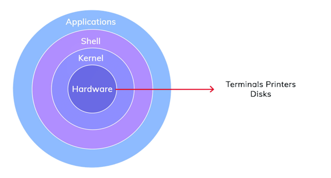

# 🐧 Linux Architecture

Linux architecture is a **layered structure** that shows how users, applications, and hardware interact.  
Each layer has a specific role to keep the system **secure, stable, and efficient**.

---

## 1. Kernel
- **Kernel is the Core of the Linux OS**
- Manages **CPU scheduling, Memory, Processes, Devices and networking**
- Acts as a **bridge between software and hardware**
- User programs **cannot access hardware directly**

---

## 2. System Libraries
- Provide **common system functions** to applications
- Allow applications to interact with the kernel **without direct access**
- Contain **reusable, pre-written code**
- Example: libraries used by `ls`, `ps`, `systemctl`

---

## 3. Shell
- Command-line interface for users
- Accepts and executes user commands
- Acts as a **link between user and kernel**
- Examples: `bash`, `sh`, `zsh`

---

## 4. System Utilities
- Built-in tools for system management
- Used for **Software installation, Monitoring, User & file management**
- Simplify system administration
- Examples: `ls`, `cp`, `top`, `df`, `systemctl`

---

## 5. Hardware Layer
- Physical components of the system
- Includes **CPU, RAM, Disk, I/O devices**
- Interacts with the kernel using **device drivers**

---

## 🐧 What is User Space?
- Area where **users and applications run**
- Includes **Shell, System utilities, Libraries, Applications**
- Communicates with kernel using **system calls**
- **No direct access to hardware**

---

## 🐧 Init / systemd

Init or systemd is the **first process started by the Linux kernel** and is responsible for booting and managing services.

### Init (Older Systems)
- First process started → **PID 1**
- Starts system services during boot
- Manages **runlevels**

**Common Runlevels**
- `0` → System shutdown  
- `1` → Single-user mode (maintenance)  
- `3` → Multi-user mode (no GUI)  
- `5` → Multi-user mode with GUI  
- `6` → Reboot  

---

### systemd (Modern Systems)
- Replacement for init → **PID 1**
- Starts services **faster using parallel execution**
- Manages:
  - System boot
  - Services and daemons
  - Resources

**Common systemd Units**
- **Service (.service)**:  Manages background services like `nginx`, `docker`, etc

- **Socket (.socket)**: Starts services when a network or socket request is received

- **Timer (.timer)**: Schedules tasks automatically, just like cron

- **Target (.target)**: Groups multiple services together (replaces runlevels)

---

## Why systemd is Important
- Faster boot time
- Automatic service recovery
- Centralized service management (`start`, `stop`, `status`)
- Controls key services like Docker, Kubernetes, Jenkins, Ngnix
- Essential for servers, cloud, and production systems

---

## 🐧 Linux Process States

A process state shows **what a process is doing at a given moment**.

### 1. Running (R)
- Process is currently executing on CPU  
- Or ready and waiting for CPU time  
- Means: **Active process**

---

### 2. Sleeping
Process is waiting for something.

#### a) Interruptible Sleep (S)
- Waiting for **Keyboard input, File read, Network response**
- Can be interrupted by signals
- Example: waiting for user input

#### b) Uninterruptible Sleep (D)
- Waiting for critical I/O (disk or hardware)
- Cannot be interrupted until task finishes
- Many `D` states indicate **disk or I/O problems**

---

### 3. Stopped (T)
- Process execution is paused
- Usually stopped manually or by debugger
- Example: pressing `Ctrl + Z`

---

### 4. Zombie (Z)
- Process finished execution
- Parent process did not collect exit status
- Exists only in process table
- Means: **Dead but not cleaned**

---

### 5. Dead (X)
- Process completely removed
- No longer exists in the system
- Rarely visible

---

## 🐧 5 Linux Commands Used Daily

- `ps aux`  
  Shows all running processes and their resource usage.  
  Used to identify stuck or high-CPU processes.

- `top` / `htop`  
  Displays real-time CPU and memory usage.  
  Helpful during performance issues.

- `systemctl status <service_name>`  
  Checks whether a service is running, stopped, or failed.  
  First command when a service goes down.

- `cp / mv`  
  Used for **copying or moving** data.

- `df -h`  
  Show **disk space usage** for all mounted file systems.

---

## 🐧 Key Takeaway

Linux is the **foundation of most production systems**.

Understanding **process states** and **systemd** enables you to:
- Debug crashed services quickly
- Identify and resolve CPU and memory issues
- Confidently analyze logs and service restarts

> This knowledge saves **hours during incidents** and is critical for DevOps engineers.
